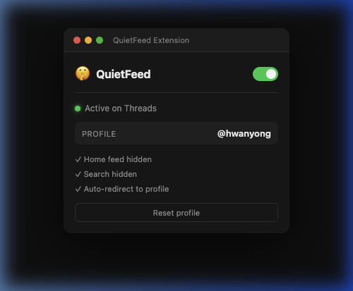
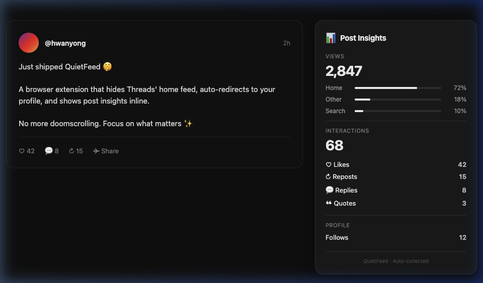

# 🤫 QuietFeed

**Focus on your Threads profile.** QuietFeed hides the home feed and search, redirects to your profile page, and shows post insights inline.

## Features

- 🏠 **Home feed hidden** — no more doomscrolling
- 🔍 **Search hidden** — stay focused
- 🔄 **Auto-redirect** — homepage → your profile page
- 📊 **Post Insights panel** — view analytics inline (2-column layout)
- 🔀 **Enable/Disable toggle** — instantly see the original Threads UI
- 🌐 **Multi-language** — English, Korean, Japanese support

<p align="center">
  
</p>

---

## Installation

### Chrome

1. [Download ZIP](../../archive/refs/heads/main.zip) or clone:
   ```bash
   git clone https://github.com/hwanyong/quietfeed.git
   ```
2. Open `chrome://extensions` in Chrome
3. Enable **Developer mode** (top-right toggle)
4. Click **"Load unpacked"**
5. Select the `chrome/` folder
6. Visit [threads.com](https://www.threads.com) and enjoy ✨

> **Note:** Chrome may show a "Developer mode extensions" warning on startup. This is normal for extensions not installed from the Chrome Web Store.

### Safari (macOS)

> Requires **Xcode** (free from Mac App Store)

1. Clone the repository:
   ```bash
   git clone https://github.com/YOUR_USERNAME/quietfeed.git
   ```
2. Open `safari/quietfeed.xcodeproj` in Xcode
3. Select **quietfeed (macOS)** target
4. Click **Run** (▶) or press `Cmd + R`
5. Open **Safari → Settings → Extensions**
6. Enable **QuietFeed**
7. Visit [threads.com](https://www.threads.com) and enjoy ✨

### Safari (iOS)

1. Open `safari/quietfeed.xcodeproj` in Xcode
2. Connect your iPhone or select a simulator
3. Select **quietfeed (iOS)** target
4. Click **Run** (▶)
5. On your device: **Settings → Safari → Extensions → QuietFeed → Enable**

---

## How It Works

### Profile Auto-Detection

QuietFeed automatically detects your Threads profile ID using:
1. Sidebar navigation links
2. Profile SVG icon parent links
3. Relay Store SSR data

No manual setup required in most cases.

### Post Insights Panel

On your own post detail pages, QuietFeed automatically collects analytics data and displays it in a side panel:

<p align="center">
  
</p>

| Metric | Description |
|---|---|
| Views | Total views + source breakdown (Home, Search, Other) |
| Interactions | Likes, Reposts, Replies, Quotes |
| Profile | New follows from the post |

> The panel is hidden on mobile viewports (< 700px).

---

## Project Structure

```
quietfeed/
├── chrome/                    # Chrome Extension (MV3)
│   ├── manifest.json
│   ├── content.js             # Feed redirect + profile detection
│   ├── background.js          # Service worker
│   ├── insights.js            # Post insights panel
│   ├── quietfeed.css          # Feed/search hiding
│   ├── insights.css           # Insights panel styles
│   ├── popup.html/js/css      # Extension popup UI
│   └── images/
├── safari/                    # Safari Web Extension (Xcode)
│   ├── quietfeed.xcodeproj
│   ├── Shared (Extension)/
│   │   └── Resources/         # Same web extension files
│   ├── macOS (App)/
│   └── iOS (App)/
└── README.md
```

---

## License

MIT
